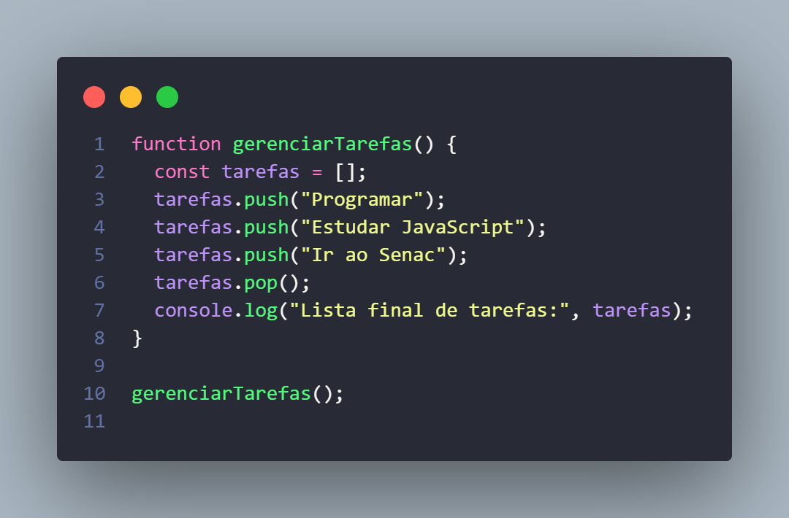
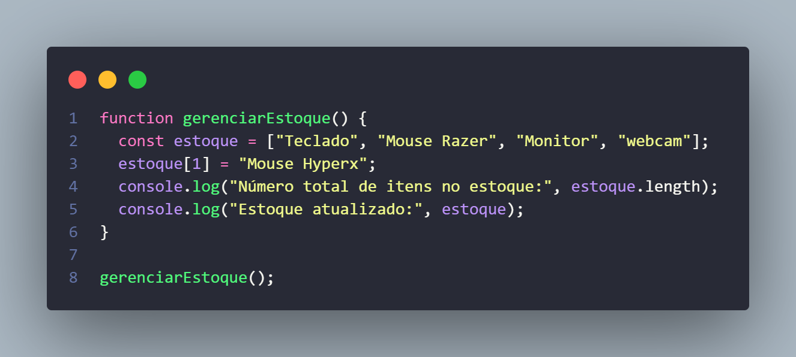
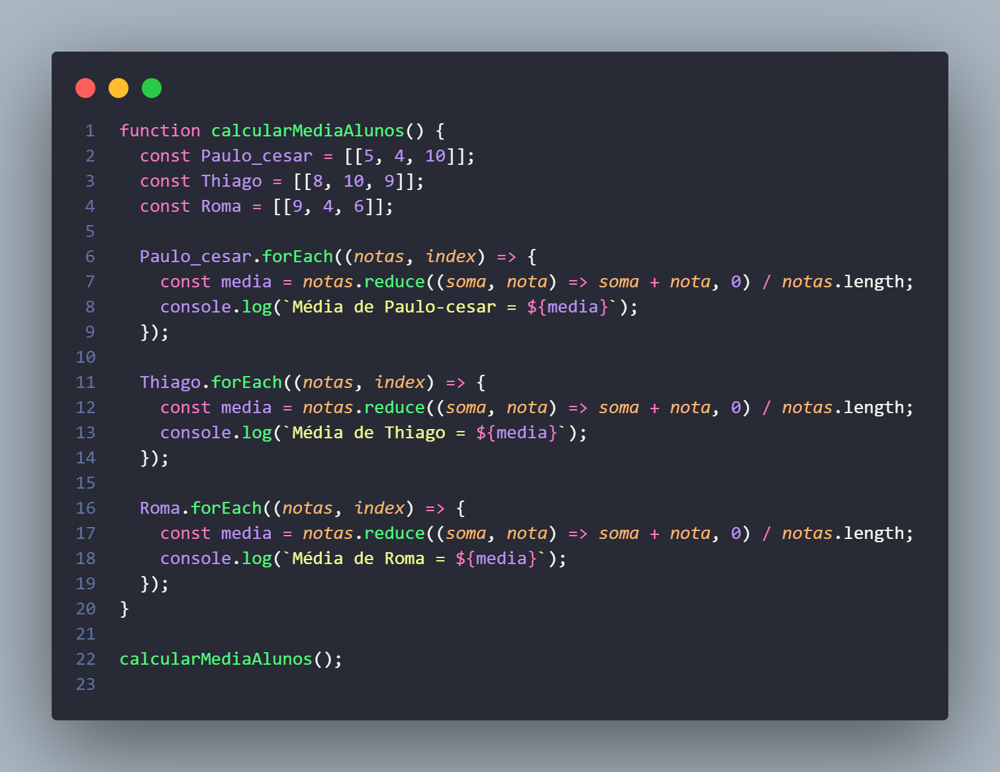
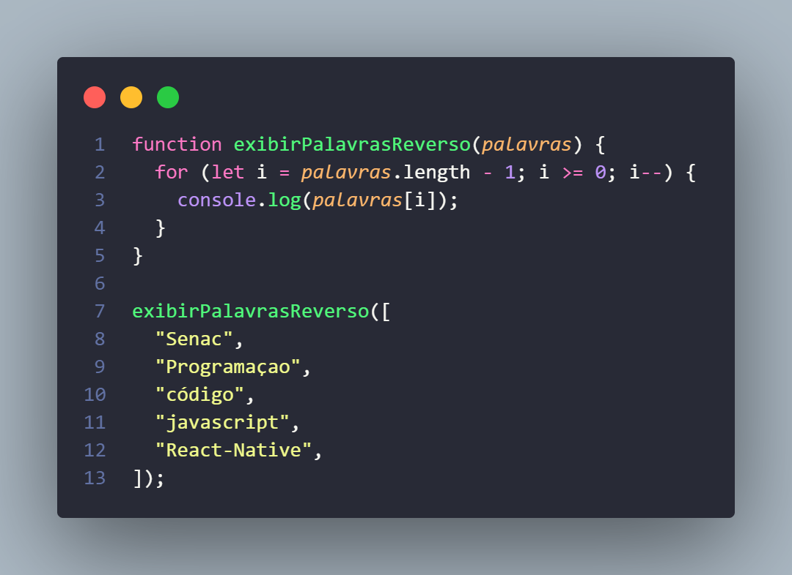
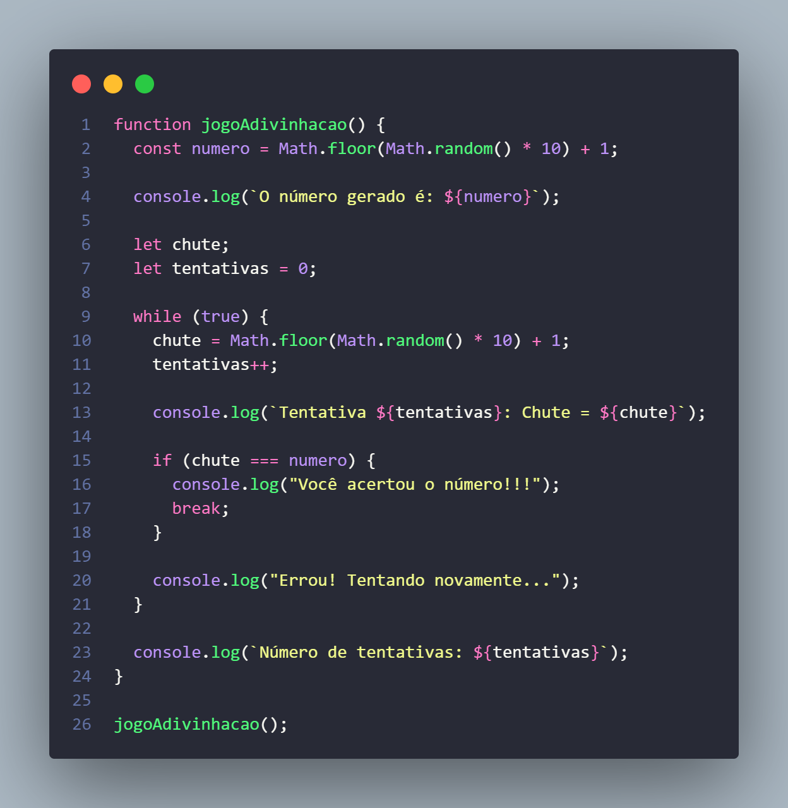

# Exercícios de JavaScript - Arrays e Estruturas de Repetição

## exercicio 01

Foi pedido para fazer um script que gerencie uma lista de tarefas.

fiz um array onde adicionei 3 tarefas utilizando o metodo 'push' e removi a ultima tarefa adicioanda ultilizando o metodo 'pop' e exibir o resultado do array no console no final.

```javascript
\**
*
*Gerencia uma lista de tarefas de adicionar e remover itens.
*@returns {void}
*/
```

<p align="center">
  
</p>

## exercicio 02

Foi pedido um programa para gerenciar um estoque.

Eu criei uma função chamada gerenciarEstoque que começa com um array chamado estoque, que contém os itens "Teclado", "Mouse Razer", "Monitor" e "webcam". Depois, eu substituí o "Mouse Razer" por "Mouse Hyperx" no índice 1 do array. Por fim, eu usei o console.log para mostrar o número total de itens no estoque, que é 4, e também exibi o estoque atualizado, que ficou assim: ['Teclado', 'Mouse Hyperx', 'Monitor', 'webcam'].

```javascript
/**
 * Gerencia um estoque de itens com atualização e contagem.
 * @returns {void}
 */
```

<p align="center">
  
</p>

## exercicio 03

foi pedido um script para criar um array para armazenar as notas dos alunos e dar a media final de todos usando um loop e exibir a nota de cada aluno no console.

Fiz uma funçao que calcula e exibe a média das notas de três alunos sendo eles: Paulo Cesar, Thiago e Roma. Para cada aluno, as notas sao armazenadas em um array dentro de um array. A funçao forEach é usada para percorrer as notas de cada aluno. A média é calculada somando todas as notas e dividindo pelo número total das notas. O resultado é exibido no console para cada aluno.

- A média é calculada com reduce somando as notas e dividindo pela quantidade delas.
- O valor da média é impresso no console.

```javascript
/**
 * Calcula a média das notas de três alunos e exibe no console.
 * @returns {void}
 */
```

<p align="center">
  
</p>

# exercicio 04

Foi solicitado um script para exibir palavras de um array em ordem reversa.

Eu criei a funçao exibirPalavrasReverso, que recebe um array de palavras como parâmetro. Dentro da função, eu usei um laço for que começa no último índice do array e vai até o primeiro, diminuindo o índice a cada iteração. Dessa forma, ele percorre o array de trás para frente e exibe cada palavra no console.

```javascript
/**
 * Exibe cada palavra de um array em ordem reversa no console.
 * @param {string} palavras - Array de palavras.
 * @returns {void}
 */
```

<p align="center">
  
</p>

# exercicio 05

Foi solicitado um jogo de adivinhação de um número entre 1 e 10.

Eu criei a funçao jogoAdivinhacao, que gera um número aleatório entre 1 e 10 usando Math.random(). Esse número gerado é mostrado no console. Em seguida, a funçao entra em um loop onde um chute também aleatório entre 1 e 10 é feito em cada iteraçao. O número de tentativas é contado e, a cada tentativa, o chute é comparado com o número gerado. Se o chute estiver correto, o jogo exibe "Você acertou o número!!!" e o loop é interrompido com break. Caso contrário, a funçao imprime "Errou! Tentando novamente..." e o loop continua até que o número seja acertado. No final, o total de tentativas é exibido no console.

```javascript
/**
 * Jogo de adivinhação de um número entre 1 e 10.
 * O programa gera um número aleatório e tenta adivinhar automaticamente até acertar.
 * Ele tambem exibe o número de tentativas feitas.
 * @returns {void}
 */
```

<p align="center">
  
</p>
